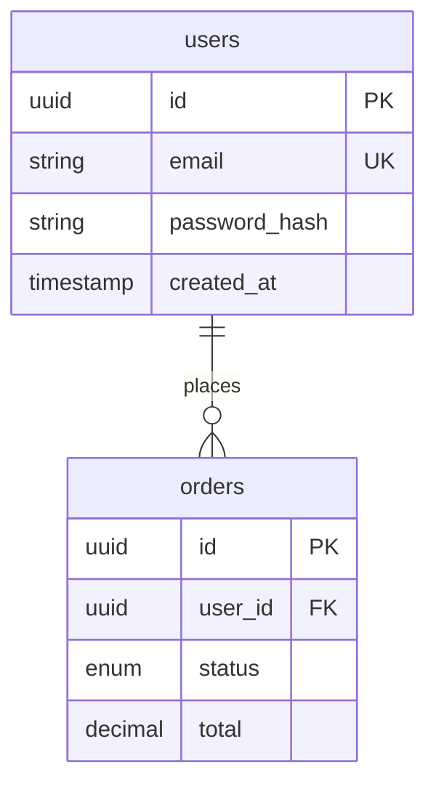

# Навык: ER Diagram + Data Dictionary

## Цель

Создать модель данных системы: ER-диаграмму со связями между сущностями и опциональный Data Dictionary с детальным описанием полей. Артефакт готов для создания схемы базы данных.

---

## Входные данные

**Обязательно:**
- Brief (бизнес-сущности)
- User Story Map (CRUD операции)

**Опционально:**
- C4 Container (какие базы данных)
- NFR (объёмы, retention, compliance)

---

## Процесс

### Шаг 1: Выделение сущностей

**Основные сущности** (существительные в требованиях):
- Пользователи, роли, права
- Бизнес-объекты (заказы, товары, задачи)
- Справочники (категории, статусы)
- Связующие таблицы (many-to-many)

### Шаг 2: Определение связей

- **1:1** — user → profile
- **1:N** — user → orders
- **N:M** — orders ↔ products (через order_items)

Для каждой: направление (FK владелец), nullable, каскад.

### Шаг 3: Детализация атрибутов

Тип данных, ограничения (PK, FK, UK, NOT NULL), бизнес-правила.

---

## Формат Mermaid ER

### Синтаксис



### Типы связей (Crow's Foot)

```
||--||   Один к одному (обязательный)
||--o|   Один к одному (опциональный справа)
||--|{   Один ко многим (обязательный)
||--o{   Один ко многим (опциональный)
}o--o{   Многие ко многим

||  — ровно один
|o  — ноль или один
|{  — один или более
o{  — ноль или более
```

### Типы данных

```
uuid, string, text, int, bigint, decimal, bool, enum, timestamp, date, jsonb, array
```

### Ограничения

```
PK — Primary Key
FK — Foreign Key
UK — Unique Key
"text" — Комментарий
```

---

## Data Dictionary (опционально)

Для сложных систем или compliance:

```markdown
## Сущность: users

| Поле | Тип | Null | Default | Индекс | Описание |
|------|-----|------|---------|--------|----------|
| id | UUID | NO | gen_random_uuid() | PK | ID |
| email | VARCHAR(255) | NO | — | UK | Email, RFC 5322 |

### Бизнес-правила
1. Email уникален (case-insensitive)
2. Soft delete (deleted_at)
```

---

## Целевая структура вывода

```markdown
# Data Model: [Название]

> Версия: 1.0
> Основано на: Brief v[X], USM v[X]

## 1. Обзор

**Всего сущностей:** N
**Тип БД:** PostgreSQL

### Группы
- **Core:** users, profiles
- **Business:** orders, products
- **Reference:** categories, statuses
- **Junction:** order_items

## 2. ER-диаграмма

[mermaid erDiagram]

## 3. Описание сущностей

### [entity]

**Назначение:** ...

[mermaid erDiagram для сущности]

**Data Dictionary:** (если нужен)
| Поле | Тип | Null | Default | Описание |

**Бизнес-правила:**
- ...

## 4. Связи

| Связь | Тип | Описание | Каскад |
|-------|-----|----------|--------|

## 5. Миграции (порядок)

1. Reference tables
2. Core tables
3. Business tables
4. Junction tables
```

---

## Pro-tips

- **Начинай с главных сущностей** — User, основной бизнес-объект
- **Soft delete** — `deleted_at` для важных сущностей
- **Audit trail** — `created_at`, `updated_at` везде
- **JSONB осторожно** — для действительно гибких данных, не для лени
- **Нормализация** — 3NF по умолчанию, денормализация обоснованно
- **UUID vs Serial** — UUID лучше для распределённых систем
- **Data Dictionary** — для сущностей с бизнес-правилами или compliance
- **Naming:** таблицы — snake_case множественное (`users`), FK — `{table_singular}_id`
