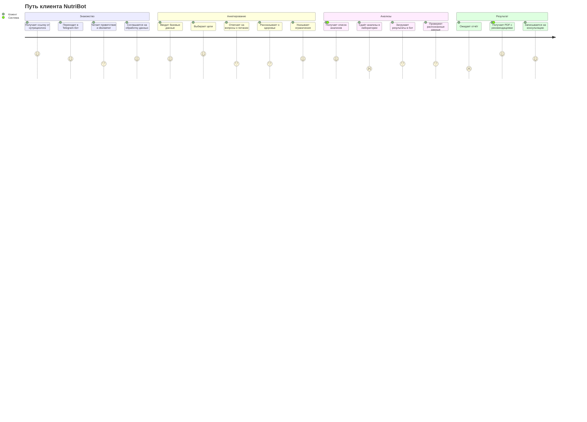
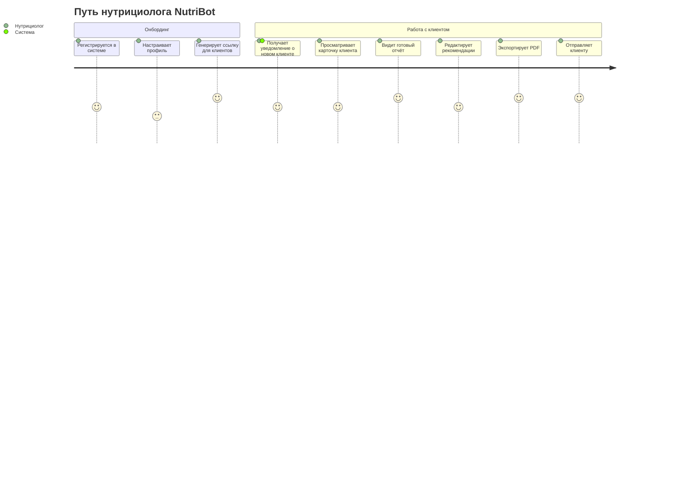

# User Journey Map: NutriBot

> **Персона:** Анна, клиент нутрициолога
> **Цель:** Получить персонализированные рекомендации по питанию
> **Основано на:** Brief v1.0, User Story Map v1.0

---

## Диаграмма: Путь клиента

---

## Диаграмма: Путь нутрициолога

---

## Анализ по фазам: Клиент

### Фаза 1: Знакомство

| Действие | Score | Почему такая оценка | Pain Points |
|----------|-------|---------------------|-------------|
| Получает ссылку от нутрициолога | 5 | Простое действие, доверие к специалисту | — |
| Переходит в Telegram-бот | 4 | Telegram привычен, но нужно открыть другое приложение | Если нет Telegram — барьер |
| Читает приветствие и disclaimer | 3 | Много текста, юридический язык | Скучно, хочется пропустить |
| Соглашается на обработку данных | 4 | Одна кнопка, быстро | Некоторые могут сомневаться |

**Что думает клиент:** "Надеюсь, это не займёт много времени. Интересно, что он мне скажет."

---

### Фаза 2: Анкетирование

| Действие | Score | Почему такая оценка | Pain Points |
|----------|-------|---------------------|-------------|
| Вводит базовые данные | 4 | Простые вопросы | Вес — чувствительная тема |
| Выбирает цели | 5 | Понятные варианты, резонирует с мотивацией | — |
| Отвечает на вопросы о питании | 3 | Много вопросов, нужно думать | Длинно, можно устать |
| Рассказывает о здоровье | 3 | Личные вопросы, может не помнить | Нужно вспоминать лекарства |
| Указывает ограничения | 4 | Конкретные вопросы с вариантами | — |

**Что думает клиент:** "Ого, столько вопросов... Но ладно, если это поможет. Надеюсь, скоро закончится."

---

### Фаза 3: Анализы

| Действие | Score | Почему такая оценка | Pain Points |
|----------|-------|---------------------|-------------|
| Получает список анализов | 4 | Полезно, понятно зачем | Может быть дорого |
| Сдаёт анализы в лаборатории | 2 | Нужно ехать, тратить время и деньги | Очереди, дискомфорт, стоимость |
| Загружает результаты в бот | 3 | Нужно сфотографировать, может не получиться с первого раза | Плохое освещение, размытое фото |
| Проверяет распознанные данные | 3 | Не уверен, правильно ли распознано | Не понимает терминов |

**Что думает клиент:** "Ненавижу сдавать анализы... Надеюсь, это последний раз. Хотя бы бот сам всё разберёт."

---

### Фаза 4: Результат

| Действие | Score | Почему такая оценка | Pain Points |
|----------|-------|---------------------|-------------|
| Ожидает отчёт | 2 | Неопределённость, сколько ждать | Нетерпение, тревога |
| Получает PDF с рекомендациями | 5 | Результат! Красивый документ, понятные рекомендации | — |
| Записывается на консультацию | 4 | Понятный следующий шаг | Нужно найти время в расписании |

**Что думает клиент:** "Наконец-то! Теперь я знаю, что делать. Надо записаться и обсудить детали."

---

## Выявленные проблемы

### Критические (Score 1-2)

| # | Фаза | Действие | Проблема | Влияние |
|---|------|----------|----------|---------|
| 1 | Анализы | Сдаёт анализы | Физический дискомфорт, стоимость, время | Клиент может отложить или бросить |
| 2 | Результат | Ожидает отчёт | Неизвестность сроков, тревога | Негативный опыт, могут не вернуться |

### Проблемные зоны (Score 3)

| # | Фаза | Действие | Проблема | Рекомендация |
|---|------|----------|----------|--------------|
| 1 | Знакомство | Читает disclaimer | Скучный текст | Упростить, добавить визуальные элементы |
| 2 | Анкетирование | Отвечает на вопросы о питании | Длинная анкета | Разбить на части, показывать прогресс |
| 3 | Анкетирование | Рассказывает о здоровье | Нужно вспоминать | Добавить подсказки, "пропустить" |
| 4 | Анализы | Загружает результаты | Проблемы с качеством фото | Инструкция по фотографированию |
| 5 | Анализы | Проверяет данные | Не понимает термины | Добавить объяснения показателей |

### Gaps в User Story Map

| # | Что отсутствует | Где должно быть | Рекомендация |
|---|-----------------|-----------------|--------------|
| 1 | Индикатор прогресса анкеты | EPIC-002 | Добавить US: "Как клиент, я хочу видеть прогресс заполнения" |
| 2 | Уведомление о сроках обработки | EPIC-005 | Добавить SS: "Система показывает ETA отчёта" |
| 3 | Инструкция по фотографированию анализов | EPIC-004 | Добавить US: "Как клиент, я хочу получить советы по съёмке" |

---

## Рекомендации по доработке USM

### Приоритет 1 (Критично)

- [ ] **[EPIC-002]:** Добавить US "Клиент видит прогресс заполнения анкеты" — снижает drop-off
- [ ] **[EPIC-005]:** Добавить SS "Система показывает примерное время готовности отчёта" — снижает тревожность
- [ ] **[EPIC-004]:** Добавить US "Клиент получает инструкцию по фотографированию" — повышает качество данных

### Приоритет 2 (Важно)

- [ ] **[EPIC-002]:** Добавить возможность сохранить и продолжить анкету позже
- [ ] **[EPIC-003]:** Показывать ориентировочную стоимость анализов
- [ ] **[EPIC-004]:** Добавить объяснения показателей при проверке данных

### Приоритет 3 (Улучшение)

- [ ] **[EPIC-001]:** Упростить текст disclaimer, добавить иконки
- [ ] **[EPIC-003]:** Добавить карту лабораторий поблизости
- [ ] **[EPIC-005]:** Push-уведомление когда отчёт готов

---

## Метрики

- **Средний score (Клиент):** 3.6 / 5
- **Критических точек (score ≤ 2):** 2
- **Самая слабая фаза:** Анализы (avg: 3.0)
- **Самая сильная фаза:** Знакомство (avg: 4.0)

---

## Следующие шаги

1. [ ] Обсудить критические проблемы с нутрициологом
2. [ ] Добавить недостающие User Stories в USM
3. [ ] Провести тестирование с 3-5 реальными клиентами
4. [ ] Пересмотреть journey после получения обратной связи
