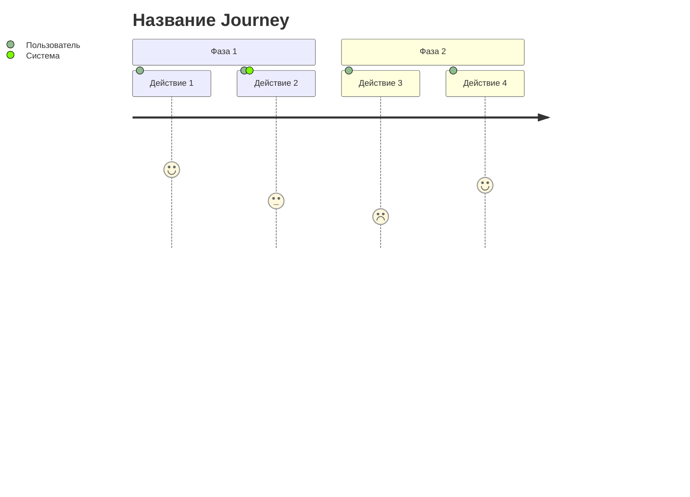
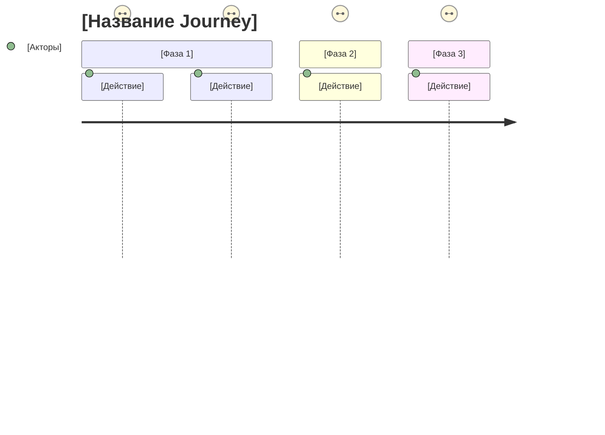
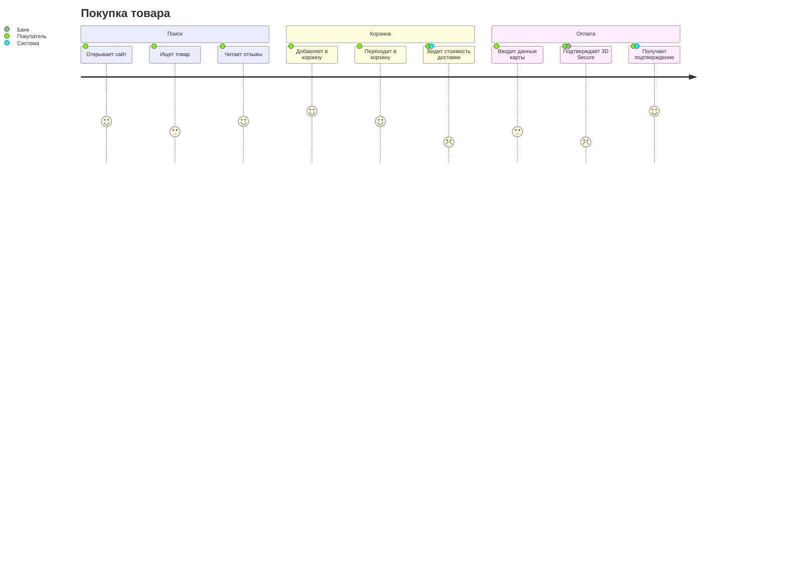

# Навык: User Journey Map (Карта пути пользователя)

## Цель

Визуализировать путь пользователя через продукт в формате Mermaid Journey. Выявить болевые точки (низкий score) и gaps в User Story Map. Результат — диаграмма + список рекомендаций по доработке USM.

---

> [!IMPORTANT]
> ## Формат: Только Mermaid Journey
>
> Этот навык использует **Mermaid Journey Diagram** — единственный diagram-as-code формат с нативной поддержкой user journey.
>
> **Почему Mermaid:**
> - Рендерится в GitHub/GitLab без плагинов
> - Простой синтаксис, легко редактировать
> - Версионируется в git
>
> **Ограничения Mermaid Journey:**
> - Только action, score (1-5), actors
> - Нет встроенных pain points, touchpoints, thinking
> - Это "скетч на салфетке", а не полноценный UX-артефакт
>
> Для детального анализа используй дополнительные секции в Markdown

---

## Входные данные

**Обязательные:**
- User Story Map (из скилла 12) — user roles, activities, tasks
- Brief (из скилла 11) — контекст, цели пользователя

**Желательные:**
- Personas (из скилла 33) — для понимания mental model
- Lean Canvas (из скилла 31) — проблемы и сегменты

---

## Синтаксис Mermaid Journey

### Шкала оценки (score 1-5)

| Score | Значение | Цвет в диаграмме | Что делать |
|-------|----------|------------------|------------|
| 1 | Критическая боль | Красный | Немедленно исправить |
| 2 | Серьёзная проблема | Оранжевый | Приоритет высокий |
| 3 | Нейтрально | Жёлтый | Можно улучшить |
| 4 | Хорошо | Светло-зелёный | Поддерживать |
| 5 | Отлично | Зелёный | Не трогать |

### Actors (участники)

Указывай всех, кто участвует в действии:
- `Пользователь` — основной актор
- `Система` — автоматические действия
- `Поддержка` — если нужен человек
- `Партнёр` — внешние участники

---

## Процесс создания

### Шаг 1: Определить персону и цель

Из Brief/Personas возьми:
- Кто основной пользователь?
- Какова его главная цель?
- В каком контексте он использует продукт?

### Шаг 2: Выделить фазы (3-6 штук)

Типичные фазы:
- **Awareness** — осознание потребности, поиск решения
- **Onboarding** — регистрация, первый опыт
- **Core Action** — выполнение основной задачи
- **Completion** — завершение, результат
- **Return** — возврат, повторное использование

*Адаптируй под конкретный продукт.*

### Шаг 3: Из USM извлечь actions

Для каждой фазы:
1. Найди соответствующие Activities и Tasks в USM
2. Преврати их в действия пользователя
3. Упорядочи хронологически

### Шаг 4: Оценить каждое действие (score 1-5)

Задай себе вопросы:
- Насколько это просто/понятно для пользователя?
- Есть ли здесь friction (трение)?
- Что пользователь чувствует в этот момент?
- Есть ли риск отвала?

### Шаг 5: Найти gaps

**Красные флаги:**
- Score 1-2 → критические проблемы
- Резкие перепады score (5 → 2) → неожиданная боль
- Длинные секции без высоких оценок → усталость пользователя
- Отсутствие actions в USM для важной фазы → gap

### Шаг 6: Сформировать рекомендации

Для каждого gap/проблемы:
- Что добавить в USM?
- Какую user story создать?
- Какой приоритет?

---

## Целевая структура

*Используй этот шаблон для финального вывода.*
# User Journey Map: [Название продукта]

> Персона: [Имя, роль]
> Цель: [Что хочет достичь]
> Основано на: Brief v[X], User Story Map v[X]

---

## Диаграмма

---

## Анализ по фазам

### [Фаза 1]: [Название]

| Действие | Score | Почему такая оценка | Pain Points |
|----------|-------|---------------------|-------------|
| [Действие 1] | [X] | [Объяснение] | [Проблемы, если есть] |
| [Действие 2] | [X] | [Объяснение] | [Проблемы, если есть] |

**Что думает пользователь:** "[Внутренний голос]"

---

### [Фаза 2]: [Название]

[Аналогично]

---

## Выявленные проблемы

### Критические (Score 1-2)

| # | Фаза | Действие | Проблема | Влияние |
|---|------|----------|----------|---------|
| 1 | [Фаза] | [Действие] | [Описание] | [Что теряем] |

### Gaps в User Story Map

| # | Что отсутствует | Где должно быть | Рекомендация |
|---|-----------------|-----------------|--------------|
| 1 | [Чего не хватает] | [Фаза/Activity] | [Добавить user story: ...] |

---

## Рекомендации по доработке USM

### Приоритет 1 (Критично)

- [ ] **[Activity]:** Добавить task "[название]" — [почему нужно]
- [ ] **[Activity]:** Добавить task "[название]" — [почему нужно]

### Приоритет 2 (Важно)

- [ ] [Рекомендация]

### Приоритет 3 (Улучшение)

- [ ] [Рекомендация]

---

## Метрики

- **Средний score:** [X.X] / 5
- **Критических точек (score ≤ 2):** [N]
- **Самая слабая фаза:** [Название] (avg: [X.X])
- **Самая сильная фаза:** [Название] (avg: [X.X])

---

## Следующие шаги

1. [ ] Обсудить критические проблемы со стейкхолдером
2. [ ] Обновить User Story Map
3. [ ] Пересмотреть journey после обновления USM

---

## Примеры

### Пример: E-commerce checkout

**Выявленные проблемы:**
- Score 2 на "Видит стоимость доставки" → неожиданно высокая цена, нужно показывать раньше
- Score 2 на "3D Secure" → friction, но неизбежно; можно улучшить UX ожидания

---

## Заметки

- Mermaid Journey — это обзорный инструмент, не детальный UX-анализ
- Для глубокого анализа используй дополнительные секции в Markdown
- Регулярно пересматривай journey после изменений в USM
- Один journey = один пользователь + одна цель (не смешивай)
