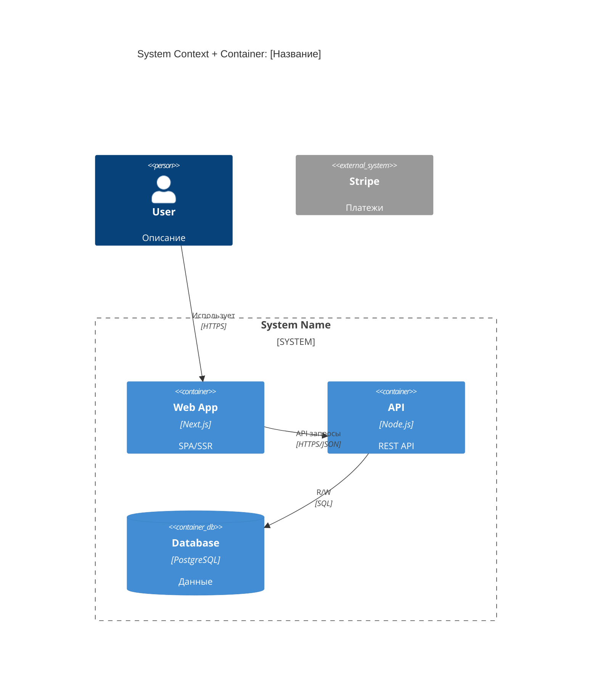

# Навык: C4 Architecture Diagrams

## Цель

Создать архитектурную диаграмму системы, объединяющую C4 Context и Container уровни в единую гибридную визуализацию. Показать границы системы, внешние зависимости и внутреннюю структуру развёртываемых компонентов.

---

## Входные данные

**Обязательно:**
- Brief (описание продукта, проблемы, пользователей)
- User Story Map (функциональность, роли)

**Опционально:**
- NFR (нефункциональные требования — влияют на выбор компонентов)

---

## Процесс

### Шаг 1: Извлечение компонентов

**Акторы** — из Brief (пользователи) и USM (роли: User, Admin, Moderator...)

**Внешние системы:**
- Платежи (Stripe, ЮKassa)
- OAuth (Google, GitHub)
- Email/SMS, внешние API, существующие системы клиента

**Контейнеры (развёртываемые единицы):**
- Web/Mobile Application
- API Server / Backend
- Database, Cache, Message Queue
- Background Workers, File Storage

### Шаг 2: Определение связей

Для каждой пары: протокол (HTTPS, WebSocket, gRPC, SQL, AMQP), направление, что передаётся.

### Шаг 3: Генерация диаграммы

Используй Mermaid C4 синтаксис.

---

## Формат Mermaid C4

### Базовый синтаксис



### Типы элементов

```
Person(id, "Label", "Description")           — Пользователь
Person_Ext(id, "Label", "Description")       — Внешний пользователь

System(id, "Label", "Description")           — Наша система
System_Ext(id, "Label", "Description")       — Внешняя система
System_Boundary(id, "Label") { ... }         — Граница системы

Container(id, "Label", "Tech", "Description")    — Контейнер
Container_Ext(id, "Label", "Tech", "Description") — Внешний контейнер
ContainerDb(id, "Label", "Tech", "Description")   — База данных
ContainerQueue(id, "Label", "Tech", "Description") — Очередь

Rel(from, to, "Label", "Technology")         — Связь
BiRel(from, to, "Label", "Technology")       — Двунаправленная связь
```

---

## Целевая структура вывода

```markdown
# C4 Architecture: [Название]

> Версия: 1.0
> Дата: [дата]
> Основано на: Brief v[X], USM v[X]

## 1. Обзор системы

**Назначение:** [из Brief]
**Ключевые пользователи:** [роли]
**Внешние зависимости:** [системы]

## 2. Архитектурная диаграмма

[mermaid C4Context здесь]

## 3. Описание компонентов

### Контейнеры

| Контейнер | Технология | Назначение | Масштабирование |
|-----------|------------|------------|-----------------|

### Внешние системы

| Система | Назначение | Интеграция | Fallback |
|---------|------------|------------|----------|

## 4. Потоки данных

### Основной поток
User → Web → API → Database

### Асинхронные операции (если есть)
API → Queue → Worker → External Service

## 5. Ключевые решения

| Решение | Выбор | Почему | Альтернативы |
|---------|-------|--------|--------------|

## 6. Нерешённые вопросы

- [ ] ...
```

---

## Pro-tips

- **Hybrid approach** — объединяем Context и Container для компактности
- **System_Boundary** — чётко показывает, что наше, а что внешнее
- **Технологии опциональны** — на ранних этапах указывай категорию (SQL Database) вместо конкретной технологии
- **Не перегружай** — для MVP достаточно 3-5 контейнеров
- **Mermaid C4** — поддерживается в GitHub, GitLab, VS Code
- **Итерируй** — диаграмма уточняется по мере проработки требований
- **Показывай протоколы** — HTTPS, WebSocket, gRPC, SQL помогают понять интеграцию
