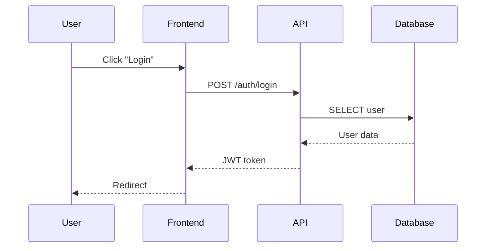
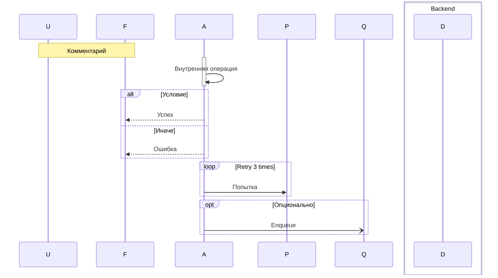

# Навык: Sequence Diagrams

## Цель

Визуализировать взаимодействия между компонентами системы для ключевых сценариев. Показать порядок вызовов, асинхронные операции и точки интеграции.

---

## Входные данные

**Обязательно:**
- User Story Map (сценарии)
- C4 Container Diagram (участники)

**Опционально:**
- ER Diagram (какие данные)
- API Inventory (endpoints)

---

## Когда нужны Sequence Diagrams

**Создавай для:**
- Сложных процессов с несколькими участниками
- Асинхронных операций (очереди, webhooks)
- Интеграций с внешними системами (платежи, OAuth)
- Сценариев с ошибками и retry
- Real-time (WebSocket, SSE)

**Не нужны для:**
- Простых CRUD
- Очевидных потоков (user → frontend → API → DB)
- Синхронных линейных сценариев

---

## Формат Mermaid Sequence

### Базовый синтаксис



### Типы стрелок

```
->>     Синхронный запрос
-->>    Синхронный ответ
-)      Асинхронный запрос
--)     Асинхронный ответ
-x      Ошибка
```

### Дополнительные элементы



---

## Типовые сценарии

**OAuth:** User → Frontend → OAuth Provider → API → Database
**Платежи:** Frontend → API → Stripe → Webhook → Worker
**Async tasks:** API → Queue → Worker → External → DB update
**Real-time:** WebSocket connect → Redis pub/sub → broadcast
**Retry:** loop с alt success/failure

---

## Целевая структура вывода

```markdown
# Sequence Diagrams: [Название]

> Основано на: USM v[X], C4 v[X]

## Обзор

| # | Сценарий | Сложность | Участники |
|---|----------|-----------|-----------|

## 1. [Сценарий]

### Контекст

**User Story:** ...
**Участники:** ...

### Диаграмма

[mermaid sequenceDiagram]

### Примечания

- ...

## Приложения

### Участники (из C4)

| ID | Название | Тип | Описание |
|----|----------|-----|----------|

### Соглашения

- `->>` / `-->>` — синхронные
- `-)` / `--)` — асинхронные
- `-x` — ошибка
```

---

## Pro-tips

- **Выбирай ключевые сценарии** — не документируй каждый endpoint
- **Happy path + error path** — ошибки важны
- **activate/deactivate** — показывает, кто работает
- **box** — группируй участников для читаемости
- **Note** — объясняй неочевидное
- **Не перегружай** — если не помещается на экран, разбей на части
- **Async отдельно** — webhook callbacks показывай отдельным блоком
