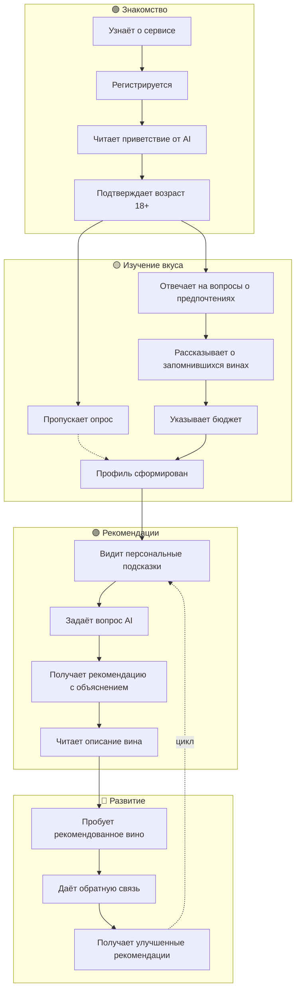

# User Journey Map: AI-Sommelier

> **Персона:** Алексей, 32 года, любит вино, но не разбирается
> **Цель:** Найти "своё" вино и перестать теряться в магазине
> **Основано на:** Brief v1.0, User Story Map v1.0

---

## Диаграмма: Путь пользователя

---

## Персона

### Алексей, 32 года

**Профессия:** Менеджер проектов в IT-компании

**Контекст:**
- Ходит в рестораны 2-3 раза в месяц
- Покупает вино домой 1-2 раза в месяц
- Бюджет на бутылку: 1000-2000₽
- Знает, что любит "красное сухое", но не может объяснить точнее

**Боли:**
- "В винном магазине теряюсь — сотни бутылок, непонятные этикетки"
- "Спрашивать у консультанта неловко — кажется, что выгляжу глупо"
- "Пару раз брал по совету — не понравилось, деньги на ветер"
- "Хочу разбираться, но читать книги про вино — скучно"

**Ожидания:**
- Простые объяснения без снобизма
- Рекомендации, которые реально подходят
- Постепенное обучение через практику

---

## Анализ по фазам

### Фаза 1: Знакомство

| Действие | Score | Почему такая оценка | Pain Points |
|----------|-------|---------------------|-------------|
| Узнаёт о сервисе | 4 | Интересно, решает реальную проблему | Нужно объяснить ценность сразу |
| Регистрируется | 4 | Простая форма email + пароль | Ещё одна регистрация... |
| Читает приветствие от AI | 5 | Дружелюбный тон, понятные обещания | — |
| Подтверждает возраст 18+ | 4 | Понятно, законодательство | Лишний клик |

**Что думает пользователь:** "О, интересно! Может, наконец-то разберусь в этих сортах и регионах."

**Эмоции:** Любопытство, лёгкий скептицизм ("посмотрим, насколько умный этот AI")

---

### Фаза 2: Изучение вкуса

| Действие | Score | Почему такая оценка | Pain Points |
|----------|-------|---------------------|-------------|
| Отвечает на вопросы о предпочтениях | 4 | Вопросы понятные, есть варианты | Не всегда знаю ответ |
| Рассказывает о запомнившихся винах | 3 | Сложно вспомнить детали | "Красное из Испании... или Италии?" |
| Указывает бюджет | 5 | Простой выбор диапазона | — |
| Видит свой вкусовой профиль | 5 | Интересно! Оказывается, я такой | — |

**Что думает пользователь:** "Хм, не всё помню про вина, которые пил... Но AI вроде понимает, что я имею в виду."

**Эмоции:** Вовлечённость, небольшая фрустрация при попытке вспомнить детали

---

### Фаза 3: Рекомендации

| Действие | Score | Почему такая оценка | Pain Points |
|----------|-------|---------------------|-------------|
| Видит персональные подсказки | 5 | Удобно, не надо думать что спросить | — |
| Задаёт вопрос AI | 5 | Можно спросить как угодно | — |
| Получает рекомендацию с объяснением | 5 | Понятно, почему это подходит МНЕ | — |
| Читает описание вина | 4 | Информативно | Некоторые термины непонятны |

**Что думает пользователь:** "О, круто! Теперь понимаю, почему это вино должно мне понравиться. Попробую!"

**Эмоции:** Уверенность, воодушевление

---

### Фаза 4: Развитие

| Действие | Score | Почему такая оценка | Pain Points |
|----------|-------|---------------------|-------------|
| Пробует рекомендованное вино | 4 | Момент истины! | Нужно купить (вне сервиса) |
| Даёт обратную связь | 4 | Просто — понравилось / не понравилось | Легко забыть |
| Получает улучшенные рекомендации | 5 | AI учится, рекомендации точнее | — |

**Что думает пользователь:** "Попробовал — и правда понравилось! Надо почаще сюда заходить."

**Эмоции:** Удовлетворение, доверие к сервису

---

## Выявленные проблемы

### Проблемные зоны (Score 3)

| # | Фаза | Действие | Проблема | Рекомендация |
|---|------|----------|----------|--------------|
| 1 | Изучение вкуса | Рассказывает о запомнившихся винах | Сложно вспомнить детали | Предлагать варианты ("Красное из Европы?"), не требовать точности |

### Зоны для улучшения (Score 4)

| # | Фаза | Действие | Проблема | Рекомендация |
|---|------|----------|----------|--------------|
| 1 | Знакомство | Регистрируется | Ещё одна регистрация | В v1.1 добавить вход через Google/Яндекс |
| 2 | Рекомендации | Читает описание вина | Некоторые термины непонятны | Добавить объяснения терминов по клику |
| 3 | Развитие | Пробует вино | Разрыв — нужно купить вне сервиса | В v2.0 добавить ссылки на покупку или UCP |
| 4 | Развитие | Даёт обратную связь | Легко забыть | Добавить напоминание через пуш/email |

---

## Gaps в User Story Map

| # | Что отсутствует | Где должно быть | Рекомендация |
|---|-----------------|-----------------|--------------|
| 1 | Объяснения винных терминов | EPIC-003 | Добавить US: "Как пользователь, я хочу понять незнакомый термин" |
| 2 | Напоминание об обратной связи | EPIC-004 | Добавить SS: "Система напоминает дать feedback" |
| 3 | Помощь при затруднении с ответом | EPIC-002 | Уже есть в US-004 AC4, достаточно |

---

## Рекомендации по доработке USM

### Приоритет 1 (MVP)

- [x] **[EPIC-002]:** AI предлагает варианты, если пользователь затрудняется — уже есть
- [ ] **[EPIC-003]:** Добавить объяснения терминов при описании вина

### Приоритет 2 (v1.1)

- [ ] **[EPIC-004]:** Добавить напоминание об обратной связи через 1-2 дня
- [ ] **[EPIC-001]:** Добавить вход через социальные сети

### Приоритет 3 (v2.0)

- [ ] **[EPIC-003]:** Добавить ссылки на покупку или интеграцию с магазинами
- [ ] **[EPIC-003]:** Добавить UCP для автоматической покупки

---

## Метрики

- **Средний score:** 4.3 / 5
- **Критических точек (score ≤ 2):** 0
- **Самая слабая фаза:** Изучение вкуса (avg: 4.25)
- **Самая сильная фаза:** Рекомендации (avg: 4.75)

---

## Ключевые моменты истины (Moments of Truth)

### Момент 1: Первая рекомендация
**Когда:** Пользователь впервые получает рекомендацию вина
**Ожидание:** AI понял мои предпочтения и предложил что-то подходящее
**Риск:** Если рекомендация не резонирует — пользователь потеряет доверие
**Митигация:** Объяснять, почему рекомендация подходит, связывать с ответами пользователя

### Момент 2: Первая дегустация
**Когда:** Пользователь пробует рекомендованное вино
**Ожидание:** Вино действительно понравится
**Риск:** Если не понравилось — разочарование
**Митигация:** Не обещать 100% попадание, объяснять что это процесс обучения

### Момент 3: Улучшенные рекомендации
**Когда:** После обратной связи пользователь получает новые рекомендации
**Ожидание:** AI учится и становится точнее
**Риск:** Если рекомендации не улучшаются — ощущение бесполезности feedback
**Митигация:** Показывать, как обратная связь повлияла на профиль

---

## Следующие шаги

1. [ ] Добавить недостающие User Stories в USM (объяснения терминов)
2. [ ] Провести тестирование с 3-5 реальными пользователями
3. [ ] Собрать обратную связь по качеству рекомендаций
4. [ ] Пересмотреть journey после получения данных
