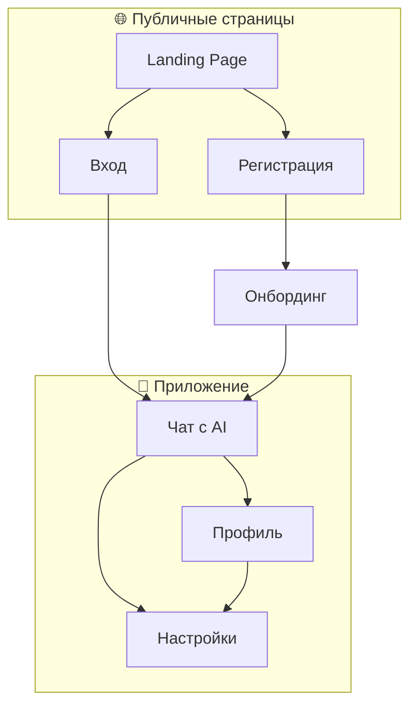

# Информационная архитектура: AI-Sommelier

> **Дата:** 2026-02-01
> **Версия:** 1.0

---

## Карта сайта



---

## Структура экранов

### 1. Landing Page
- Hero: ценностное предложение
- Как это работает (3 шага)
- CTA: Попробовать бесплатно

### 2. Регистрация / Вход
- Email + пароль
- Подтверждение возраста 18+

### 3. Онбординг (опционально)
- Вопросы о предпочтениях
- Можно пропустить

### 4. Чат с AI (главный экран)
```
┌─────────────────────────────────────┐
│  AI-Sommelier            [Профиль] │
├─────────────────────────────────────┤
│                                     │
│  💬 История диалога                 │
│                                     │
│  ┌─────────────────────────────┐    │
│  │ 🍷 Вино для ужина           │    │
│  └─────────────────────────────┘    │
│  ┌─────────────────────────────┐    │
│  │ 🎁 Подарок до 3000₽         │    │
│  └─────────────────────────────┘    │
│                                     │
├─────────────────────────────────────┤
│  [Введите сообщение...]      [➤]   │
└─────────────────────────────────────┘
```

### 5. Профиль
- Имя, email
- Бюджет (можно изменить)
- Кнопка выхода
- Удалить аккаунт

---

## Навигация

| Откуда | Куда | Действие |
|--------|------|----------|
| Landing | Регистрация | Клик CTA |
| Landing | Вход | Клик "Войти" |
| Регистрация | Онбординг | После регистрации |
| Онбординг | Чат | Завершение / Пропуск |
| Чат | Профиль | Иконка профиля |
| Профиль | Чат | Назад |

---

## Сущности данных

### Пользователь
- id, email, password_hash
- name
- age_confirmed: boolean
- created_at

### Вкусовой профиль
- user_id
- sweetness_preference
- body_preference
- budget_range
- experience_level
- updated_at

### Сообщение
- id, user_id
- role: user | assistant
- content
- created_at

### Вино (каталог)
- id, name
- producer, region, country
- grape_variety
- year
- type: red | white | rose | sparkling
- sweetness, acidity, tannins, body
- description, tasting_notes
- price_range

### Feedback
- id, user_id, wine_id
- rating: liked | disliked
- created_at
