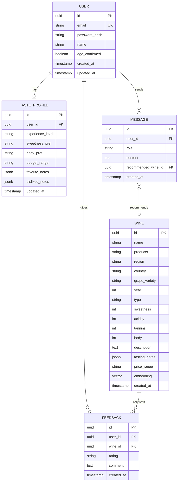

# ER Диаграмма: AI-Sommelier

> **Дата:** 2026-02-01
> **Версия:** 1.0

---

## Диаграмма



---

## Описание таблиц

### users
| Поле | Тип | Описание |
|------|-----|----------|
| id | UUID | Primary key |
| email | VARCHAR(255) | Уникальный email |
| password_hash | VARCHAR(255) | Bcrypt хеш |
| name | VARCHAR(100) | Имя пользователя |
| age_confirmed | BOOLEAN | Подтвердил 18+ |
| created_at | TIMESTAMP | Дата регистрации |
| updated_at | TIMESTAMP | Последнее обновление |

### taste_profiles
| Поле | Тип | Описание |
|------|-----|----------|
| id | UUID | Primary key |
| user_id | UUID | FK → users |
| experience_level | VARCHAR(20) | newbie / amateur / expert |
| sweetness_pref | VARCHAR(20) | dry / semi-dry / sweet |
| body_pref | VARCHAR(20) | light / medium / full |
| budget_range | VARCHAR(20) | Ценовой диапазон |
| favorite_notes | JSONB | Любимые ноты |
| disliked_notes | JSONB | Нелюбимые ноты |
| updated_at | TIMESTAMP | Последнее обновление |

### messages
| Поле | Тип | Описание |
|------|-----|----------|
| id | UUID | Primary key |
| user_id | UUID | FK → users |
| role | VARCHAR(20) | user / assistant |
| content | TEXT | Текст сообщения |
| recommended_wine_id | UUID | FK → wines |
| created_at | TIMESTAMP | Время сообщения |

### wines
| Поле | Тип | Описание |
|------|-----|----------|
| id | UUID | Primary key |
| name | VARCHAR(255) | Название |
| producer | VARCHAR(255) | Производитель |
| region | VARCHAR(100) | Регион |
| country | VARCHAR(100) | Страна |
| grape_variety | VARCHAR(100) | Сорт винограда |
| year | INT | Год урожая |
| type | VARCHAR(20) | red / white / rose / sparkling |
| sweetness | INT | 1-5 |
| acidity | INT | 1-5 |
| tannins | INT | 1-5 |
| body | INT | 1-5 |
| description | TEXT | Описание |
| tasting_notes | JSONB | Вкусовые ноты |
| price_range | VARCHAR(20) | Ценовой диапазон |
| embedding | VECTOR(1536) | pgvector |
| created_at | TIMESTAMP | Дата добавления |

### feedback
| Поле | Тип | Описание |
|------|-----|----------|
| id | UUID | Primary key |
| user_id | UUID | FK → users |
| wine_id | UUID | FK → wines |
| rating | VARCHAR(20) | liked / disliked |
| comment | TEXT | Комментарий |
| created_at | TIMESTAMP | Дата |

---

## SQL Schema (единый файл)

```sql
-- schema.sql

-- Extensions
CREATE EXTENSION IF NOT EXISTS "uuid-ossp";
CREATE EXTENSION IF NOT EXISTS "vector";

-- Users
CREATE TABLE users (
    id UUID PRIMARY KEY DEFAULT uuid_generate_v4(),
    email VARCHAR(255) UNIQUE NOT NULL,
    password_hash VARCHAR(255) NOT NULL,
    name VARCHAR(100),
    age_confirmed BOOLEAN DEFAULT FALSE,
    created_at TIMESTAMP DEFAULT NOW(),
    updated_at TIMESTAMP DEFAULT NOW()
);

-- Taste Profiles
CREATE TABLE taste_profiles (
    id UUID PRIMARY KEY DEFAULT uuid_generate_v4(),
    user_id UUID UNIQUE REFERENCES users(id) ON DELETE CASCADE,
    experience_level VARCHAR(20),
    sweetness_pref VARCHAR(20),
    body_pref VARCHAR(20),
    budget_range VARCHAR(20),
    favorite_notes JSONB DEFAULT '[]',
    disliked_notes JSONB DEFAULT '[]',
    updated_at TIMESTAMP DEFAULT NOW()
);

-- Wines
CREATE TABLE wines (
    id UUID PRIMARY KEY DEFAULT uuid_generate_v4(),
    name VARCHAR(255) NOT NULL,
    producer VARCHAR(255),
    region VARCHAR(100),
    country VARCHAR(100),
    grape_variety VARCHAR(100),
    year INT,
    type VARCHAR(20) NOT NULL,
    sweetness INT CHECK (sweetness BETWEEN 1 AND 5),
    acidity INT CHECK (acidity BETWEEN 1 AND 5),
    tannins INT CHECK (tannins BETWEEN 1 AND 5),
    body INT CHECK (body BETWEEN 1 AND 5),
    description TEXT,
    tasting_notes JSONB DEFAULT '[]',
    price_range VARCHAR(20),
    embedding VECTOR(1536),
    created_at TIMESTAMP DEFAULT NOW()
);

-- Messages
CREATE TABLE messages (
    id UUID PRIMARY KEY DEFAULT uuid_generate_v4(),
    user_id UUID REFERENCES users(id) ON DELETE CASCADE,
    role VARCHAR(20) NOT NULL,
    content TEXT NOT NULL,
    recommended_wine_id UUID REFERENCES wines(id),
    created_at TIMESTAMP DEFAULT NOW()
);

-- Feedback
CREATE TABLE feedback (
    id UUID PRIMARY KEY DEFAULT uuid_generate_v4(),
    user_id UUID REFERENCES users(id) ON DELETE CASCADE,
    wine_id UUID REFERENCES wines(id) ON DELETE CASCADE,
    rating VARCHAR(20) NOT NULL,
    comment TEXT,
    created_at TIMESTAMP DEFAULT NOW(),
    UNIQUE(user_id, wine_id)
);

-- Indexes
CREATE INDEX idx_users_email ON users(email);
CREATE INDEX idx_messages_user_id ON messages(user_id);
CREATE INDEX idx_messages_created_at ON messages(created_at);
CREATE INDEX idx_wines_type ON wines(type);
CREATE INDEX idx_wines_embedding ON wines USING ivfflat (embedding vector_cosine_ops);
CREATE INDEX idx_feedback_user_id ON feedback(user_id);
```
