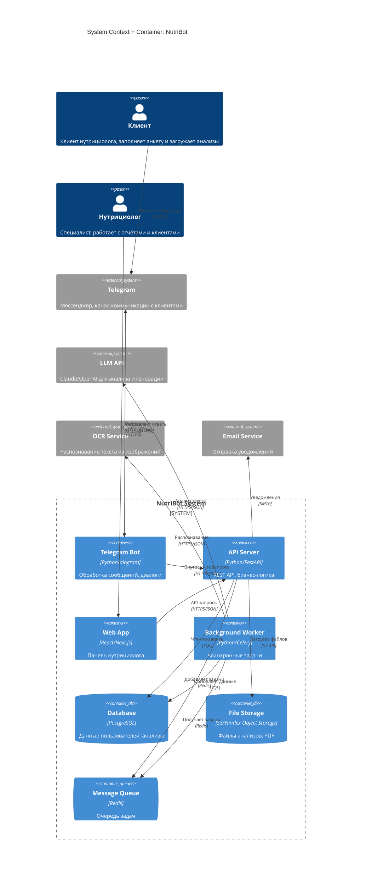

# C4 Architecture: NutriBot

> **Версия:** 1.0
> **Дата:** 2026-01-30
> **Основано на:** Brief v1.0, USM v1.0, NFR v1.0

---

## 1. Обзор системы

**Назначение:** AI-ассистент для нутрициологов, автоматизирующий сбор анамнеза клиентов и анализ результатов лабораторных исследований.

**Ключевые пользователи:**
- Клиент (взаимодействует через Telegram)
- Нутрициолог (использует веб-панель)

**Внешние зависимости:**
- Telegram Bot API
- LLM API (Claude/OpenAI)
- OCR сервис
- Email-провайдер (SMTP)

---

## 2. Архитектурная диаграмма



---

## 3. Описание компонентов

### Контейнеры

| Контейнер | Технология | Назначение | Масштабирование |
|-----------|------------|------------|-----------------|
| **Telegram Bot** | Python 3.11 + aiogram 3.x | Обработка входящих сообщений, управление диалогами, отправка ответов | Вертикальное (1 инстанс достаточен для MVP) |
| **API Server** | Python 3.11 + FastAPI | REST API для веб-панели и бота, бизнес-логика, авторизация | Горизонтальное (несколько реплик) |
| **Web App** | Next.js 14 + React | SPA для нутрициологов: клиенты, отчёты, настройки | CDN + SSR |
| **Background Worker** | Python + Celery | OCR обработка, LLM запросы, генерация PDF | Горизонтальное (по нагрузке) |
| **Database** | PostgreSQL 15 | Хранение всех данных: пользователи, анкеты, анализы | Primary + Replica |
| **File Storage** | Yandex Object Storage (S3) | Загруженные файлы анализов, сгенерированные PDF | Managed service |
| **Message Queue** | Redis 7 | Очередь задач для Celery, кэширование | Managed service |

### Внешние системы

| Система | Назначение | Интеграция | Fallback |
|---------|------------|------------|----------|
| **Telegram Bot API** | Канал коммуникации с клиентами | Webhook (inbound) + HTTP API (outbound) | Нет (критическая зависимость) |
| **Claude API** | Анализ текста, генерация отчётов | REST API | Переключение на OpenAI |
| **OpenAI API** | Backup LLM | REST API | — |
| **OCR Service** | Распознавание анализов из изображений | REST API (Yandex Vision / Google Vision) | Ручной ввод |
| **Email Service** | Уведомления нутрициологам | SMTP (Yandex / Mailgun) | Push в Telegram |

---

## 4. Потоки данных

### Основной поток: Клиент заполняет анкету

```
Client → Telegram → Bot → API → Database
                              ↓
                           Worker → LLM (анализ)
                              ↓
                           Database (structured data)
```

### Поток: Загрузка и обработка анализов

```
Client → Telegram → Bot → API → Storage (файл)
                              ↓
                           Queue → Worker → OCR → LLM
                                                   ↓
                                              Database (результаты)
                                                   ↓
                                              Notification → Nutritionist
```

### Поток: Генерация отчёта

```
Nutritionist → Web → API → Worker → LLM (генерация)
                                       ↓
                                    Storage (PDF)
                                       ↓
                                    API → Bot → Client (отправка)
```

### Асинхронные операции

| Операция | Триггер | Worker Task |
|----------|---------|-------------|
| OCR анализов | Загрузка файла | `process_lab_results` |
| Генерация отчёта | Запрос нутрициолога | `generate_report` |
| Отправка PDF клиенту | Нажатие кнопки | `send_report_to_client` |
| Напоминание о заполнении | Cron (24h) | `send_reminder` |

---

## 5. Ключевые решения

| Решение | Выбор | Почему | Альтернативы |
|---------|-------|--------|--------------|
| **Основной язык** | Python | Экосистема ML/AI, aiogram, быстрая разработка | Node.js (менее зрелые AI-библиотеки) |
| **Веб-фреймворк** | FastAPI | Async, автодокументация, типизация | Django (тяжелее), Flask (меньше возможностей) |
| **Telegram-библиотека** | aiogram 3.x | Современный async, хорошая поддержка | python-telegram-bot (менее гибкий) |
| **Frontend** | Next.js | SSR, React, хорошая DX | Vue/Nuxt (меньше экосистема) |
| **База данных** | PostgreSQL | Надёжность, JSONB для гибких данных | MySQL (хуже с JSON) |
| **Очередь задач** | Celery + Redis | Стандарт для Python, масштабируемость | RQ (проще, но менее функционален) |
| **LLM** | Claude API | Качество, длинный контекст | OpenAI (как backup) |
| **OCR** | Yandex Vision | Локализация в РФ, русский язык | Google Vision (дороже, не РФ) |
| **Хостинг** | Yandex Cloud | 152-ФЗ, локализация данных | AWS/GCP (данные за рубежом) |

---

## 6. Нерешённые вопросы

- [ ] **Точный выбор OCR:** Yandex Vision vs Tesseract (self-hosted) — зависит от качества на тестовых данных
- [ ] **Стратегия кэширования:** Что кэшировать в Redis кроме задач?
- [ ] **Multi-tenancy:** Как изолировать данные разных нутрициологов?
- [ ] **Backup LLM:** Автоматическое переключение Claude → OpenAI или ручное?
- [ ] **Rate limiting:** Как защитить API от злоупотреблений?

---

## 7. Диаграмма развёртывания (Deployment)

```
┌─────────────────────────────────────────────────────────────┐
│                      Yandex Cloud                           │
│                                                             │
│  ┌─────────────┐    ┌─────────────┐    ┌─────────────┐     │
│  │  Compute    │    │  Compute    │    │  Compute    │     │
│  │  Instance   │    │  Instance   │    │  Instance   │     │
│  │             │    │             │    │             │     │
│  │ ┌─────────┐ │    │ ┌─────────┐ │    │ ┌─────────┐ │     │
│  │ │   Bot   │ │    │ │   API   │ │    │ │ Worker  │ │     │
│  │ └─────────┘ │    │ └─────────┘ │    │ └─────────┘ │     │
│  └─────────────┘    └─────────────┘    └─────────────┘     │
│         │                  │                  │             │
│         └──────────────────┼──────────────────┘             │
│                            │                                │
│  ┌─────────────────────────┼─────────────────────────────┐ │
│  │           Internal Network (VPC)                       │ │
│  └─────────────────────────┼─────────────────────────────┘ │
│                            │                                │
│  ┌─────────────┐    ┌─────────────┐    ┌─────────────┐     │
│  │ PostgreSQL  │    │   Redis     │    │  Object     │     │
│  │ (Managed)   │    │  (Managed)  │    │  Storage    │     │
│  └─────────────┘    └─────────────┘    └─────────────┘     │
│                                                             │
└─────────────────────────────────────────────────────────────┘
         │
         │ HTTPS
         ▼
┌─────────────┐    ┌─────────────┐    ┌─────────────┐
│  Telegram   │    │ Claude API  │    │ Yandex      │
│  Bot API    │    │ (Anthropic) │    │ Vision OCR  │
└─────────────┘    └─────────────┘    └─────────────┘
```

---

## 8. Безопасность

### Сетевая безопасность
- Все компоненты в приватной VPC
- Публичный доступ только через Load Balancer
- Telegram webhook с IP-фильтрацией
- HTTPS везде (TLS 1.3)

### Данные
- Шифрование at rest (PostgreSQL, Object Storage)
- Шифрование in transit (TLS)
- Минимизация PII в логах
- Псевдонимизация данных для LLM

### Авторизация
- JWT для API (access + refresh tokens)
- Telegram ID для аутентификации клиентов
- RBAC: nutritionist, admin
