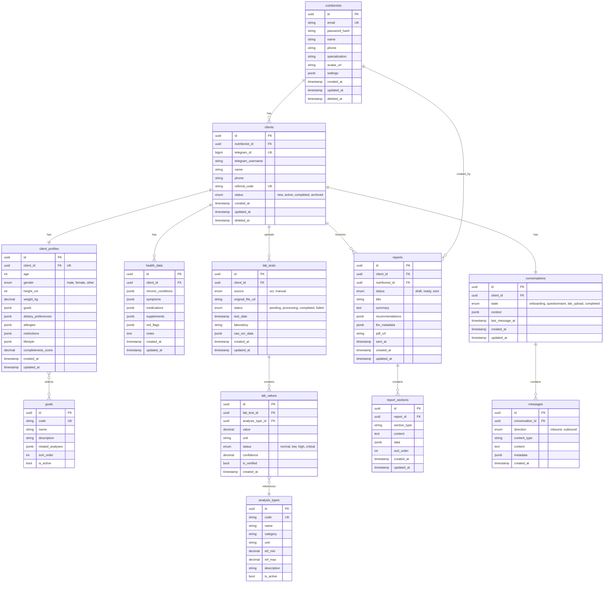
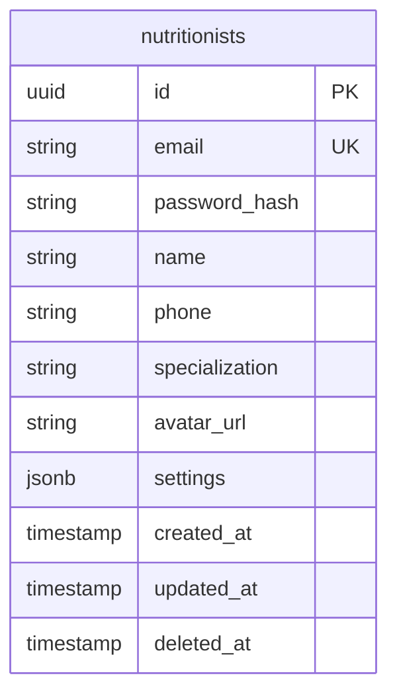
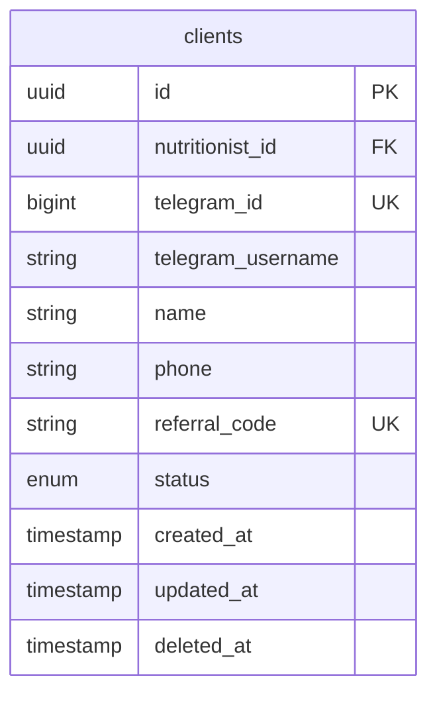
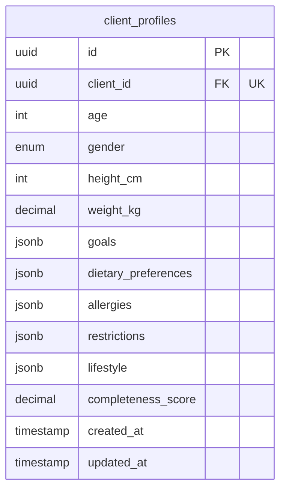

# Data Model: NutriBot

> **Версия:** 1.0
> **Основано на:** Brief v1.0, USM v1.0, C4 v1.0
> **Тип БД:** PostgreSQL 15

---

## 1. Обзор

**Всего сущностей:** 12

### Группы

| Группа | Сущности | Описание |
|--------|----------|----------|
| **Core** | nutritionists, clients | Основные пользователи |
| **Profile** | client_profiles, health_data | Данные анкет |
| **Lab** | lab_tests, lab_results, lab_values | Анализы и результаты |
| **Reports** | reports, report_sections | Отчёты |
| **Reference** | goals, analysis_types | Справочники |
| **System** | conversations, messages | Логи диалогов |

---

## 2. ER-диаграмма (полная)



---

## 3. Описание сущностей

### nutritionists

**Назначение:** Нутрициологи — основные пользователи системы (B2B)



**Бизнес-правила:**
- Email уникален (case-insensitive)
- Soft delete через deleted_at
- Settings содержит: notification_preferences, branding, questionnaire_config

---

### clients

**Назначение:** Клиенты нутрициологов (пользователи Telegram-бота)



**Бизнес-правила:**
- Один клиент — один нутрициолог (для MVP)
- Referral code генерируется для приглашения
- Status: new → active → completed → archived

---

### client_profiles

**Назначение:** Профиль клиента — демография и предпочтения



**JSONB структуры:**

```json
// goals
["weight_loss", "energy", "health"]

// dietary_preferences
{
  "meals_per_day": 3,
  "typical_breakfast": "Овсянка с фруктами",
  "typical_lunch": "Суп и салат",
  "typical_dinner": "Куриная грудка с овощами",
  "snacks": ["орехи", "фрукты"],
  "water_intake_liters": 1.5
}

// allergies
["lactose", "nuts"]

// restrictions
{
  "vegetarian": false,
  "vegan": false,
  "gluten_free": true,
  "religious": null,
  "disliked_foods": ["печень", "морепродукты"]
}

// lifestyle
{
  "activity_level": "moderate",
  "sleep_quality": "poor",
  "stress_level": "high",
  "work_schedule": "office_9_to_6"
}
```

---

### health_data

**Назначение:** Медицинские данные клиента

**Бизнес-правила:**
- Red flags требуют немедленного внимания нутрициолога
- Может быть несколько записей (история)

**JSONB структуры:**

```json
// chronic_conditions
["diabetes_type_2", "hypertension"]

// symptoms
["fatigue", "digestive_issues", "skin_problems"]

// medications
[
  {"name": "Метформин", "dosage": "500mg", "frequency": "twice_daily"}
]

// supplements
[
  {"name": "Витамин D", "dosage": "2000 IU", "frequency": "daily"}
]

// red_flags
["diabetes", "pregnancy", "kidney_disease"]
```

---

### lab_tests

**Назначение:** Загруженные результаты анализов

**Бизнес-правила:**
- Source: ocr (автоматическое распознавание) или manual (ручной ввод)
- Status workflow: pending → processing → completed/failed
- raw_ocr_data хранит сырой результат OCR для дебага

---

### analysis_types (справочник)

**Назначение:** Типы лабораторных показателей с референсными значениями

**Примеры записей:**

| code | name | category | unit | ref_min | ref_max |
|------|------|----------|------|---------|---------|
| HGB | Гемоглобин | ОАК | g/L | 120 | 160 |
| GLU | Глюкоза | Биохимия | mmol/L | 3.9 | 6.1 |
| TSH | ТТГ | Гормоны | mIU/L | 0.4 | 4.0 |
| FERR | Ферритин | Железо | ng/mL | 12 | 150 |
| VIT_D | Витамин D | Витамины | ng/mL | 30 | 100 |

---

### lab_values

**Назначение:** Конкретные значения показателей из анализов

**Бизнес-правила:**
- Связывает lab_test с analysis_type
- Status определяется автоматически по ref_min/ref_max
- Confidence (0-1) показывает уверенность OCR
- is_verified — подтверждено пользователем

---

### reports

**Назначение:** Отчёты для клиентов

**Бизнес-правила:**
- Генерируются автоматически (draft), редактируются нутрициологом (ready), отправляются клиенту (sent)
- llm_metadata содержит промпты и параметры генерации
- pdf_url — ссылка на сгенерированный PDF

---

### conversations / messages

**Назначение:** Логи диалогов в Telegram-боте

**Бизнес-правила:**
- Один активный conversation на клиента
- State машина: onboarding → questionnaire → lab_upload → completed
- Context содержит текущий прогресс заполнения

---

## 4. Связи

| Связь | Тип | Описание | Каскад |
|-------|-----|----------|--------|
| nutritionists → clients | 1:N | Нутрициолог имеет много клиентов | SET NULL on delete |
| clients → client_profiles | 1:1 | Один профиль на клиента | CASCADE |
| clients → health_data | 1:N | Может быть история | CASCADE |
| clients → lab_tests | 1:N | Много анализов | CASCADE |
| clients → reports | 1:N | Много отчётов | CASCADE |
| clients → conversations | 1:1 | Один активный диалог | CASCADE |
| lab_tests → lab_values | 1:N | Анализ содержит показатели | CASCADE |
| lab_values → analysis_types | N:1 | Справочник типов | RESTRICT |
| reports → report_sections | 1:N | Секции отчёта | CASCADE |
| conversations → messages | 1:N | История сообщений | CASCADE |

---

## 5. Индексы

```sql
-- Поиск клиентов нутрициолога
CREATE INDEX idx_clients_nutritionist ON clients(nutritionist_id) WHERE deleted_at IS NULL;

-- Поиск по Telegram ID
CREATE UNIQUE INDEX idx_clients_telegram ON clients(telegram_id);

-- Анализы клиента
CREATE INDEX idx_lab_tests_client ON lab_tests(client_id, created_at DESC);

-- Показатели анализа
CREATE INDEX idx_lab_values_test ON lab_values(lab_test_id);

-- Отчёты клиента
CREATE INDEX idx_reports_client ON reports(client_id, created_at DESC);

-- Сообщения диалога
CREATE INDEX idx_messages_conversation ON messages(conversation_id, created_at);
```

---

## 6. Миграции (порядок)

1. **Reference tables:** goals, analysis_types
2. **Core tables:** nutritionists
3. **Client tables:** clients, client_profiles, health_data
4. **Lab tables:** lab_tests, lab_values
5. **Report tables:** reports, report_sections
6. **Dialog tables:** conversations, messages
