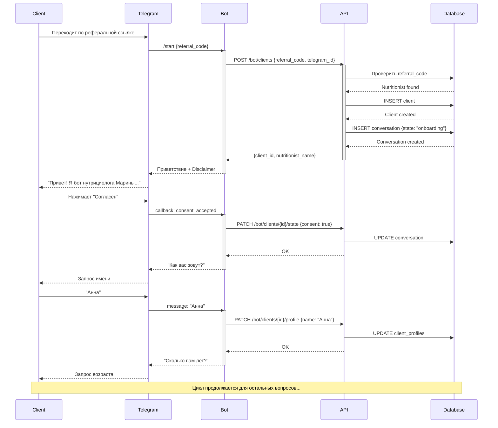
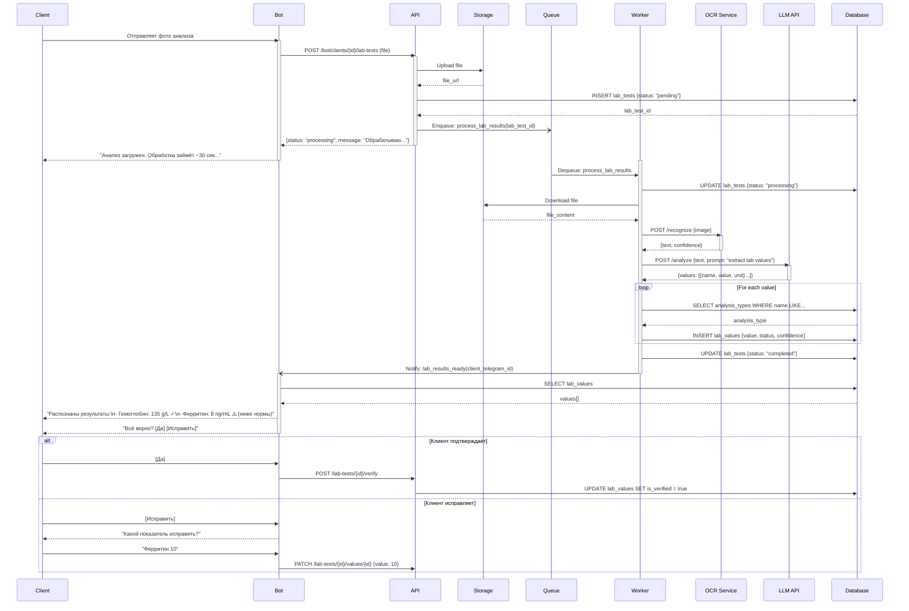
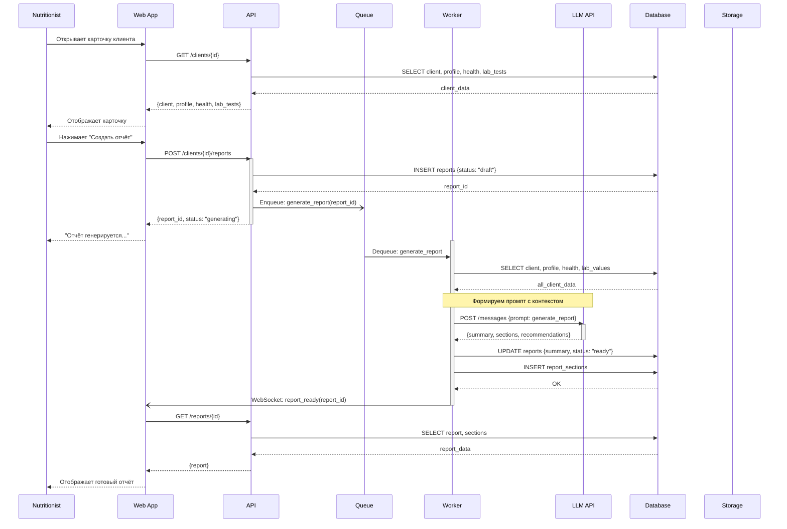
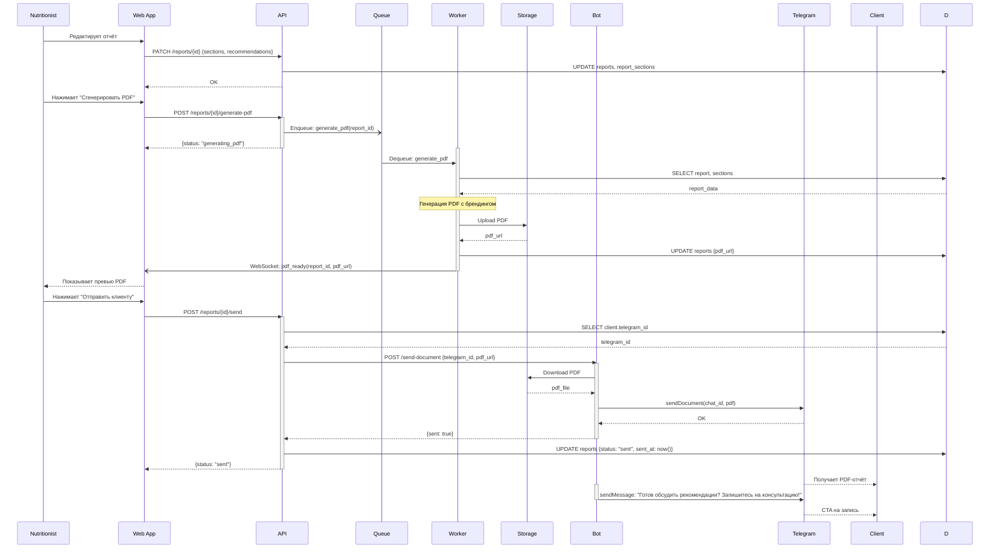

# Sequence Diagrams: NutriBot

> **Основано на:** USM v1.0, C4 v1.0, API v1.0
> **Версия:** 1.0

---

## Обзор

| # | Сценарий | Сложность | Участники |
|---|----------|-----------|-----------|
| 1 | Онбординг клиента | Средняя | Client, Telegram, Bot, API, DB |
| 2 | Загрузка и обработка анализов | Высокая | Client, Bot, API, Queue, Worker, OCR, LLM, DB |
| 3 | Генерация отчёта | Высокая | Nutritionist, Web, API, Worker, LLM, DB |
| 4 | Отправка отчёта клиенту | Средняя | Nutritionist, Web, API, Bot, Telegram, Client |

---

## 1. Онбординг клиента

### Контекст

**User Story:** US-001, US-002, SS-001
**Участники:** Client, Telegram, Bot, API, Database

### Диаграмма

### Примечания

- Referral code извлекается из deep link (`t.me/nutribot?start=REF123`)
- Согласие на обработку данных сохраняется как юридический факт
- State machine: onboarding → questionnaire → lab_upload → completed

---

## 2. Загрузка и обработка анализов

### Контекст

**User Story:** US-010, US-011, SS-004
**Участники:** Client, Bot, API, Queue, Worker, OCR Service, LLM, Database

### Диаграмма

### Примечания

- OCR + LLM работают последовательно: сначала распознавание текста, затем извлечение структурированных данных
- Confidence score показывает уверенность OCR, низкий score → запрос подтверждения
- При ошибке OCR предлагается ручной ввод
- Показатели со статусом "low" или "high" помечаются как red flags

---

## 3. Генерация отчёта

### Контекст

**User Story:** SS-005, SS-006, US-015
**Участники:** Nutritionist, Web App, API, Queue, Worker, LLM, Database

### Диаграмма

### Примечания

- Генерация асинхронная, нутрициолог получает уведомление через WebSocket
- Промпт для LLM включает: профиль, анамнез, все показатели анализов с интерпретацией
- Отчёт структурирован по секциям: резюме, анализ показателей, рекомендации, вопросы
- Нутрициолог может редактировать любую секцию перед отправкой

---

## 4. Отправка отчёта клиенту

### Контекст

**User Story:** US-016, US-017
**Участники:** Nutritionist, Web App, API, Worker, Storage, Bot, Telegram, Client

### Диаграмма

### Примечания

- PDF генерируется с брендингом нутрициолога (логотип, контакты)
- После отправки статус отчёта меняется на "sent"
- Бот предлагает клиенту записаться на консультацию (CTA)
- История отправок сохраняется для аналитики

---

## Приложения

### Участники (из C4)

| ID | Название | Тип | Описание |
|----|----------|-----|----------|
| C | Client | Person | Клиент нутрициолога |
| N | Nutritionist | Person | Нутрициолог |
| T | Telegram | External System | Мессенджер |
| B | Bot | Container | Telegram Bot (aiogram) |
| W | Web App | Container | SPA для нутрициолога |
| A | API | Container | REST API (FastAPI) |
| D | Database | Container | PostgreSQL |
| S | Storage | Container | Object Storage (S3) |
| Q | Queue | Container | Redis Queue |
| WK | Worker | Container | Celery Worker |
| OCR | OCR Service | External System | Yandex Vision |
| LLM | LLM API | External System | Claude/OpenAI |

### Соглашения

| Символ | Значение |
|--------|----------|
| `->>` | Синхронный запрос |
| `-->>` | Синхронный ответ |
| `-)` | Асинхронный запрос (enqueue) |
| `--)` | Асинхронное уведомление |
| `-x` | Ошибка |
| `activate/deactivate` | Время выполнения |
| `Note over` | Комментарий |
| `alt/else/end` | Условное ветвление |
| `loop` | Цикл |
