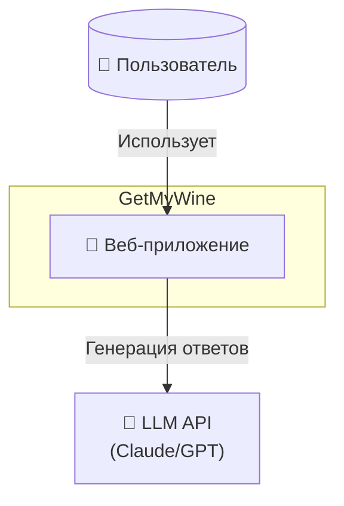
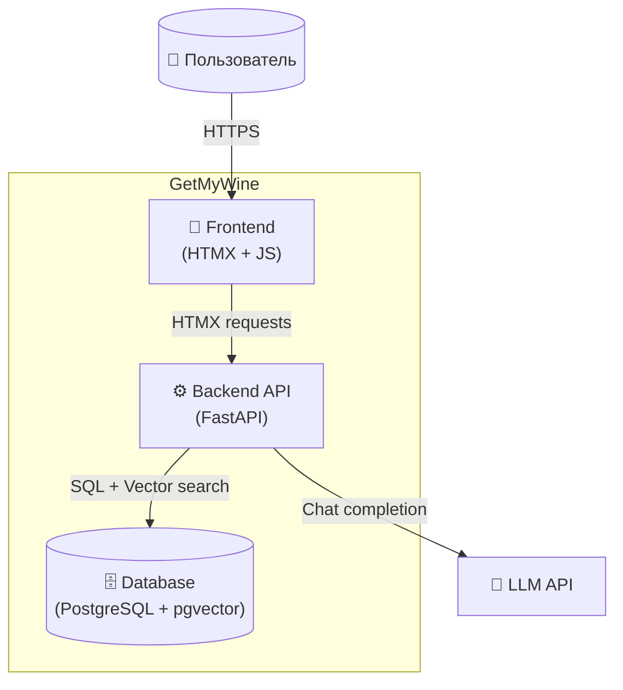
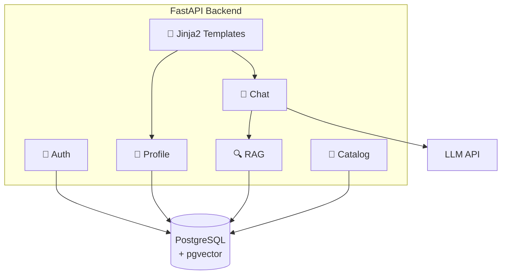
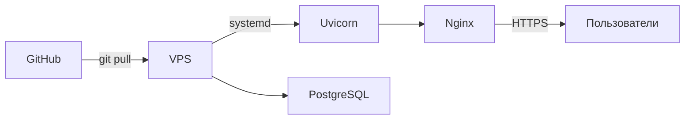

# C4 Архитектура: GetMyWine

> **Дата:** 2026-02-01
> **Версия:** 1.0

---

## Level 1: System Context



**Описание:**
- Пользователь взаимодействует через веб-браузер
- Система использует внешний LLM API для генерации рекомендаций

---

## Level 2: Container Diagram



**Контейнеры:**

| Контейнер | Технология | Назначение |
|-----------|------------|------------|
| Frontend | HTMX + JavaScript | UI, чат-интерфейс, реактивность |
| Backend | FastAPI (Python) | Бизнес-логика, API, SSR шаблонов |
| Database | PostgreSQL + pgvector | Пользователи, профили, история, embeddings |
| LLM API | Claude / GPT | Генерация ответов |

---

## Level 3: Component Diagram (Backend)



**Компоненты:**

| Компонент | Ответственность |
|-----------|-----------------|
| Auth | Регистрация, вход, сессии (JWT) |
| Chat | Обработка сообщений, история |
| Profile | Вкусовой профиль, настройки |
| Catalog | CRUD вин, поиск |
| RAG | Поиск релевантных вин через pgvector |
| Templates | Jinja2 шаблоны для HTMX |

---

## Технологический стек

### MVP Stack:

| Слой | Технология | Почему |
|------|------------|--------|
| **Frontend** | HTMX + Vanilla JS | Простота, минимум JS, быстрая разработка |
| **Backend** | FastAPI | Async, типизация, хорошая документация |
| **Templates** | Jinja2 | SSR, интеграция с HTMX |
| **Database** | PostgreSQL | Надёжность, pgvector встроен |
| **Vector** | pgvector | Embeddings в той же БД |
| **LLM** | Claude API | Качество, русский язык |
| **Hosting** | VPS | Полный контроль, фиксированная стоимость |

### Python зависимости:

```
fastapi
uvicorn
sqlalchemy
asyncpg
pgvector
jinja2
python-jose[cryptography]  # JWT
passlib[bcrypt]            # passwords
anthropic                  # Claude API
```

---

## Деплоймент



**Процесс:**
1. Push в main
2. SSH на VPS, git pull
3. Перезапуск сервиса через systemd
4. Nginx как reverse proxy + SSL (Let's Encrypt)

**Структура на VPS:**
```
/opt/getmywine/
├── app/
│   ├── main.py
│   ├── routers/
│   ├── models/
│   ├── templates/
│   └── static/
├── .env
└── venv/
```
