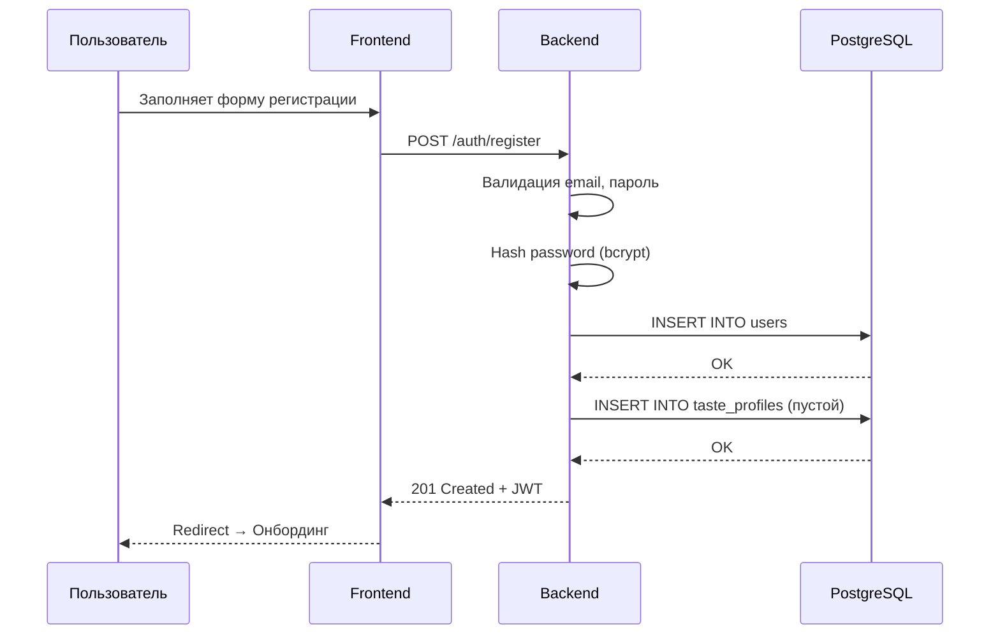
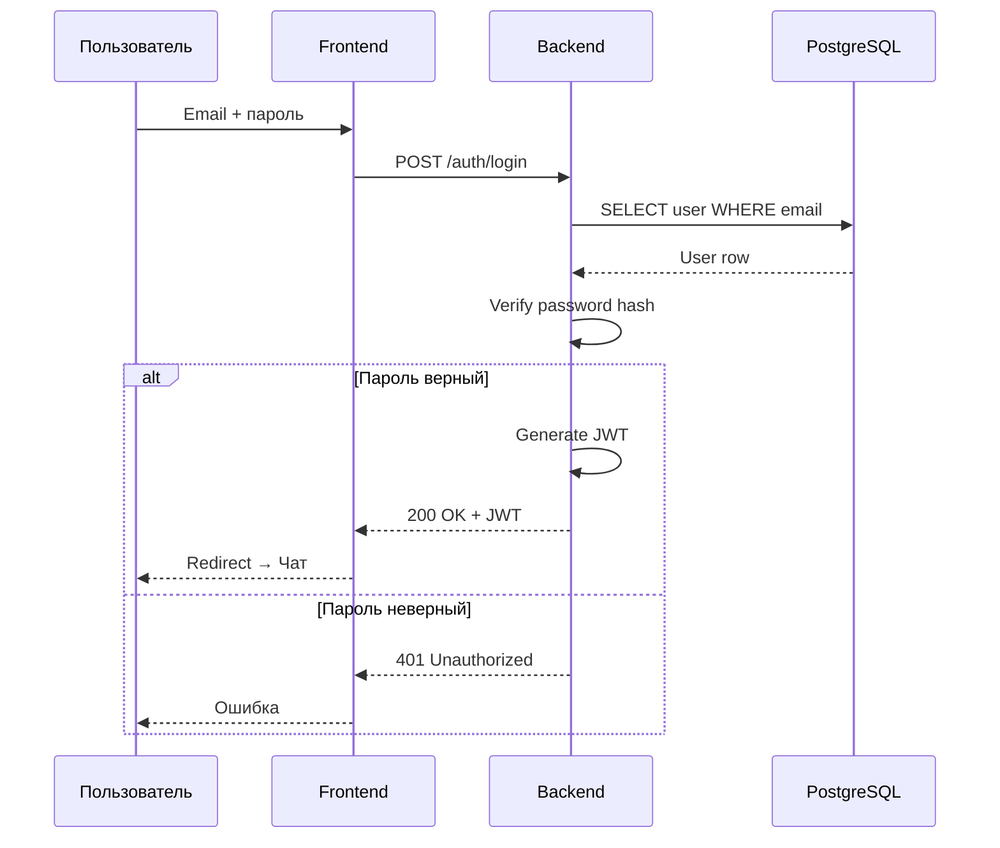
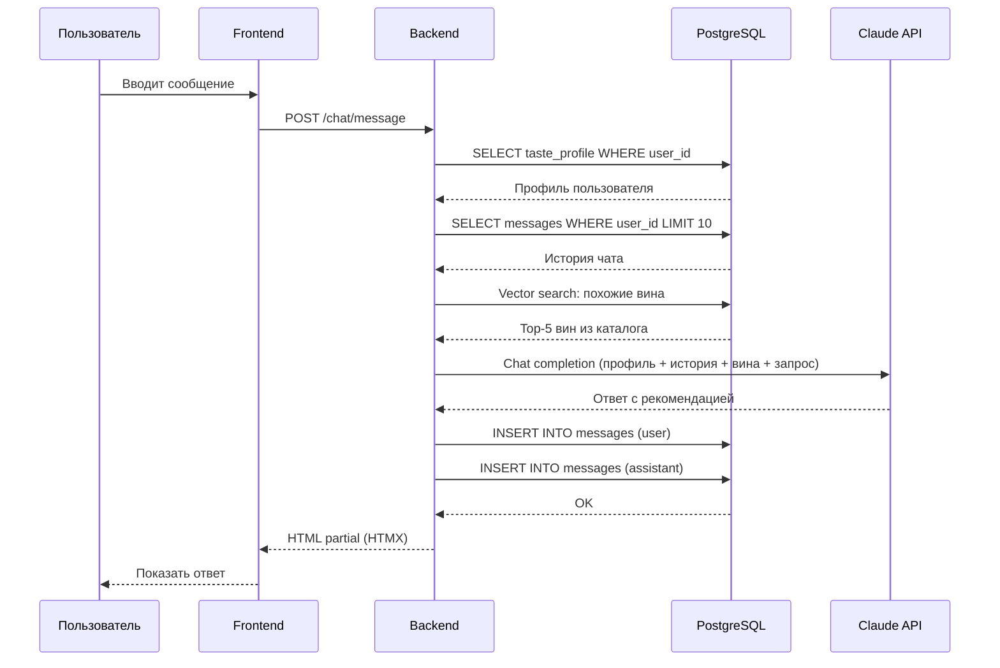
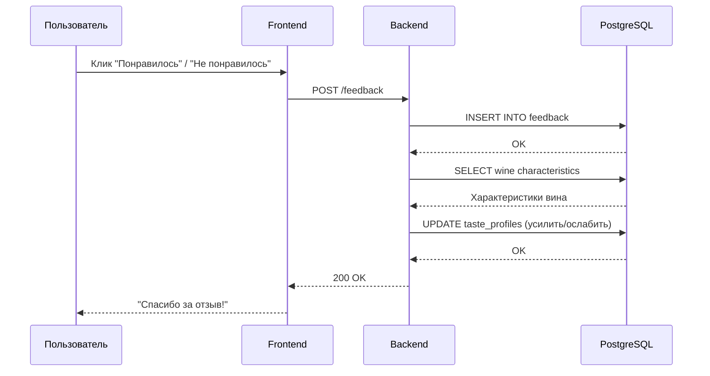
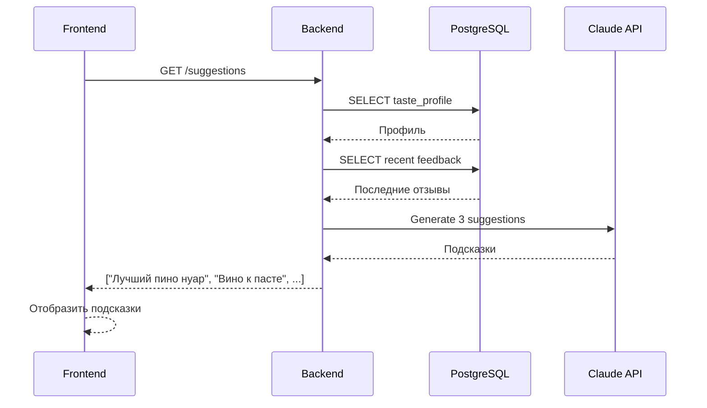

# Sequence Диаграммы: GetMyWine

> **Дата:** 2026-02-01
> **Версия:** 1.0

---

## 1. Регистрация пользователя



---

## 2. Вход в систему



---

## 3. Онбординг (изучение вкуса)

```mermaid
sequenceDiagram
    participant U as Пользователь
    participant F as Frontend
    participant B as Backend
    participant DB as PostgreSQL

    U->>F: Открывает онбординг
    F->>B: GET /onboarding/questions
    B-->>F: Список вопросов

    loop Каждый вопрос
        F-->>U: Показать вопрос
        U->>F: Ответ
        F->>B: POST /onboarding/answer
        B->>DB: UPDATE taste_profiles
        DB-->>B: OK
    end

    B-->>F: Онбординг завершён
    F-->>U: Redirect → Чат

    Note over U,F: Или "Пропустить" → сразу в чат
```



---

## 4. Отправка сообщения и получение рекомендации



---

## 5. Обратная связь на рекомендацию



---

## 6. Генерация персонализированных подсказок



---

## Примечания

### HTMX интеграция
- Backend возвращает HTML partials вместо JSON
- `hx-post`, `hx-get` для AJAX-запросов
- `hx-swap="beforeend"` для добавления сообщений в чат

### Пример HTMX endpoint

```python
@app.post("/chat/message")
async def send_message(request: Request, content: str = Form(...)):
    # ... логика ...
    return templates.TemplateResponse(
        "partials/message.html",
        {"request": request, "message": response}
    )
```
