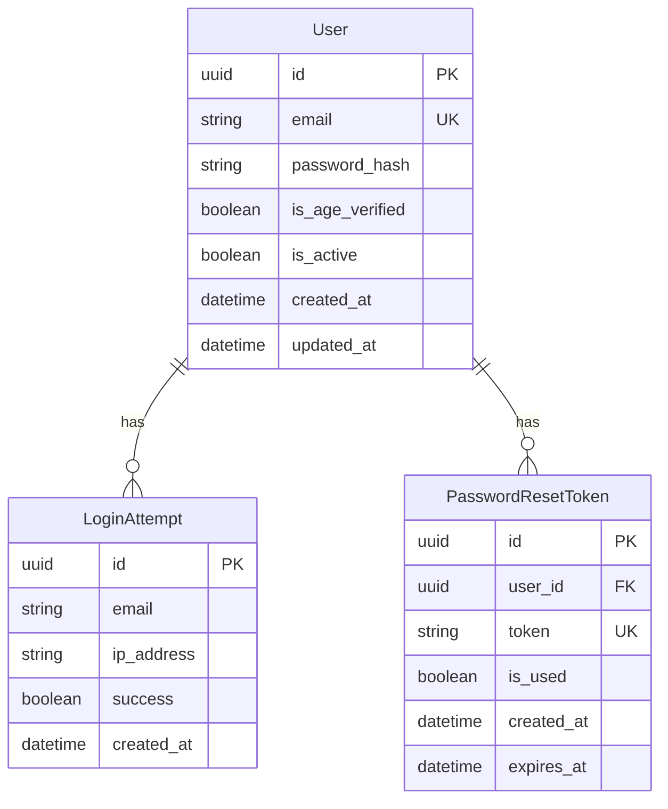

# Модель данных: Регистрация и авторизация

**Дата**: 2026-02-02
**Фича**: 001-user-auth

## ER-диаграмма



## Сущности

### User (Пользователь)

| Поле | Тип | Ограничения | Описание |
|------|-----|-------------|----------|
| id | UUID | PK, auto | Уникальный идентификатор |
| email | VARCHAR(255) | UNIQUE, NOT NULL | Email пользователя |
| password_hash | VARCHAR(255) | NOT NULL | Bcrypt хеш пароля |
| is_age_verified | BOOLEAN | NOT NULL, DEFAULT false | Подтверждение 18+ |
| is_active | BOOLEAN | NOT NULL, DEFAULT true | Статус аккаунта |
| created_at | TIMESTAMP | NOT NULL, DEFAULT now() | Дата регистрации |
| updated_at | TIMESTAMP | NOT NULL, DEFAULT now() | Дата обновления |

**Валидации**:
- email: Синтаксически валидный email (Pydantic EmailStr)
- password: Минимум 8 символов (проверяется до хеширования)
- is_age_verified: Должен быть true для завершения регистрации

**Индексы**:
- `ix_user_email` (email) — для поиска при входе

---

### LoginAttempt (Попытка входа)

| Поле | Тип | Ограничения | Описание |
|------|-----|-------------|----------|
| id | UUID | PK, auto | Уникальный идентификатор |
| email | VARCHAR(255) | NOT NULL | Email попытки (может не существовать в User) |
| ip_address | VARCHAR(45) | NOT NULL | IP адрес (IPv4/IPv6) |
| success | BOOLEAN | NOT NULL | Результат попытки |
| created_at | TIMESTAMP | NOT NULL, DEFAULT now() | Время попытки |

**Назначение**: Rate limiting и аудит безопасности

**Индексы**:
- `ix_login_attempt_email_created` (email, created_at) — для подсчёта попыток
- `ix_login_attempt_ip_created` (ip_address, created_at) — для rate limiting по IP

**Очистка**: Записи старше 24 часов могут быть удалены (cron job)

---

### PasswordResetToken (Токен сброса пароля)

| Поле | Тип | Ограничения | Описание |
|------|-----|-------------|----------|
| id | UUID | PK, auto | Уникальный идентификатор |
| user_id | UUID | FK → User.id, NOT NULL | Владелец токена |
| token | VARCHAR(255) | UNIQUE, NOT NULL | Случайный токен (URL-safe) |
| is_used | BOOLEAN | NOT NULL, DEFAULT false | Использован ли |
| created_at | TIMESTAMP | NOT NULL, DEFAULT now() | Дата создания |
| expires_at | TIMESTAMP | NOT NULL | Дата истечения (created_at + 1 час) |

**Валидации**:
- token: 32 символа, URL-safe base64
- expires_at: Автоматически created_at + 1 час
- is_used: После использования токен помечается и не может быть использован повторно

**Индексы**:
- `ix_password_reset_token` (token) — для поиска по токену

**Очистка**: Истёкшие/использованные токены удаляются через 24 часа

---

## Миграции

### 001_create_users_table

```sql
CREATE TABLE users (
    id UUID PRIMARY KEY DEFAULT gen_random_uuid(),
    email VARCHAR(255) NOT NULL UNIQUE,
    password_hash VARCHAR(255) NOT NULL,
    is_age_verified BOOLEAN NOT NULL DEFAULT false,
    is_active BOOLEAN NOT NULL DEFAULT true,
    created_at TIMESTAMP NOT NULL DEFAULT now(),
    updated_at TIMESTAMP NOT NULL DEFAULT now()
);

CREATE INDEX ix_user_email ON users(email);
```

### 002_create_login_attempts_table

```sql
CREATE TABLE login_attempts (
    id UUID PRIMARY KEY DEFAULT gen_random_uuid(),
    email VARCHAR(255) NOT NULL,
    ip_address VARCHAR(45) NOT NULL,
    success BOOLEAN NOT NULL,
    created_at TIMESTAMP NOT NULL DEFAULT now()
);

CREATE INDEX ix_login_attempt_email_created ON login_attempts(email, created_at);
CREATE INDEX ix_login_attempt_ip_created ON login_attempts(ip_address, created_at);
```

### 003_create_password_reset_tokens_table

```sql
CREATE TABLE password_reset_tokens (
    id UUID PRIMARY KEY DEFAULT gen_random_uuid(),
    user_id UUID NOT NULL REFERENCES users(id) ON DELETE CASCADE,
    token VARCHAR(255) NOT NULL UNIQUE,
    is_used BOOLEAN NOT NULL DEFAULT false,
    created_at TIMESTAMP NOT NULL DEFAULT now(),
    expires_at TIMESTAMP NOT NULL
);

CREATE INDEX ix_password_reset_token ON password_reset_tokens(token);
```
