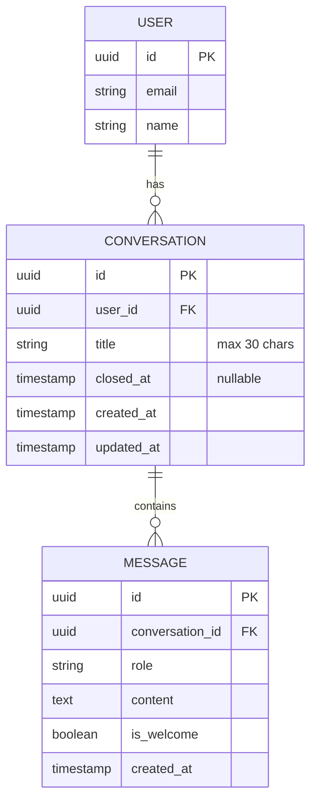

# Data Model: Sessions History

**Feature**: 010-sessions
**Date**: 2026-02-03
**Version**: 1.0

## Entity Changes

### Conversation (Modified)

**Table**: `conversations`

```sql
-- Migration: 010_sessions_support.py

-- Step 1: Remove unique constraint on user_id
ALTER TABLE conversations DROP CONSTRAINT IF EXISTS conversations_user_id_key;

-- Step 2: Add new columns
ALTER TABLE conversations
    ADD COLUMN title VARCHAR(30),
    ADD COLUMN closed_at TIMESTAMP WITH TIME ZONE;

-- Step 3: Create index for user sessions query
CREATE INDEX idx_conversations_user_sessions
    ON conversations (user_id, created_at DESC);

-- Step 4: Update existing conversations with date-based titles
UPDATE conversations
SET title = TO_CHAR(created_at, 'DD Mon YYYY')
WHERE title IS NULL;
```

**SQLAlchemy Model Changes:**

```python
# app/models/conversation.py

class Conversation(Base):
    """Conversation model for chat sessions."""

    __tablename__ = "conversations"

    id: Mapped[uuid.UUID] = mapped_column(
        UUID(as_uuid=True),
        primary_key=True,
        default=uuid.uuid4,
    )
    user_id: Mapped[uuid.UUID] = mapped_column(
        UUID(as_uuid=True),
        ForeignKey("users.id", ondelete="CASCADE"),
        nullable=False,
        index=True,  # REMOVED: unique=True
    )
    title: Mapped[Optional[str]] = mapped_column(  # NEW
        String(30),
        nullable=True,
    )
    closed_at: Mapped[Optional[datetime]] = mapped_column(  # NEW
        DateTime(timezone=True),
        nullable=True,
    )
    created_at: Mapped[datetime] = mapped_column(
        DateTime(timezone=True),
        nullable=False,
        server_default=func.now(),
    )
    updated_at: Mapped[datetime] = mapped_column(
        DateTime(timezone=True),
        nullable=False,
        server_default=func.now(),
        onupdate=func.now(),
    )

    # Computed property
    @property
    def is_active(self) -> bool:
        """Session is active if not closed and updated within 30 min."""
        if self.closed_at is not None:
            return False
        threshold = datetime.now(timezone.utc) - timedelta(minutes=30)
        return self.updated_at > threshold

    # Relationships
    user: Mapped["User"] = relationship("User", lazy="joined")
    messages: Mapped[list["Message"]] = relationship(
        "Message",
        back_populates="conversation",
        cascade="all, delete-orphan",
        order_by="Message.created_at",
    )
```

---

## Field Specifications

### conversations

| Field | Type | Constraints | Description |
|-------|------|-------------|-------------|
| id | UUID | PK, default uuid4 | Unique identifier |
| user_id | UUID | FK → users.id, NOT NULL, INDEX | Owner of the session |
| title | VARCHAR(30) | NULLABLE | Auto-generated session title |
| closed_at | TIMESTAMP WITH TZ | NULLABLE | When session was closed |
| created_at | TIMESTAMP WITH TZ | NOT NULL, DEFAULT now() | Creation time |
| updated_at | TIMESTAMP WITH TZ | NOT NULL, DEFAULT now() | Last activity |

### Indexes

| Index Name | Columns | Purpose |
|------------|---------|---------|
| idx_conversations_user_sessions | (user_id, created_at DESC) | Fast session list query |
| idx_conversations_user_id | (user_id) | FK lookup (existing) |

---

## Relationships



---

## Pydantic Schemas

```python
# app/schemas/conversation.py

from datetime import datetime
from typing import Optional
from uuid import UUID
from pydantic import BaseModel, Field


class SessionBase(BaseModel):
    """Base session schema."""
    title: Optional[str] = Field(None, max_length=30)


class SessionCreate(BaseModel):
    """Schema for creating a new session (no fields needed)."""
    pass


class SessionSummary(SessionBase):
    """Session summary for sidebar list."""
    id: UUID
    title: Optional[str]
    created_at: datetime
    updated_at: datetime
    is_active: bool
    message_count: int

    class Config:
        from_attributes = True


class SessionDetail(SessionSummary):
    """Full session detail with messages."""
    messages: list["MessageRead"]

    class Config:
        from_attributes = True


class SessionList(BaseModel):
    """Paginated list of sessions."""
    sessions: list[SessionSummary]
    has_more: bool
    total: int


class SessionTitleUpdate(BaseModel):
    """Schema for updating session title."""
    title: str = Field(..., max_length=30)
```

---

## State Transitions

```
                  ┌──────────────┐
                  │   CREATED    │
                  └──────┬───────┘
                         │
                         │ first message
                         ▼
                  ┌──────────────┐
                  │    ACTIVE    │ ◄──── messages
                  └──────┬───────┘
                         │
          ┌──────────────┼──────────────┐
          │              │              │
    30 min inactivity    │    user clicks "new"
          │              │              │
          ▼              │              ▼
   ┌──────────────┐      │       ┌──────────────┐
   │  AUTO-CLOSED │      │       │    CLOSED    │
   └──────────────┘      │       └──────────────┘
                         │
                  90 days later
                         │
                         ▼
                  ┌──────────────┐
                  │   DELETED    │
                  └──────────────┘
```

---

## Validation Rules

| Rule | Field | Constraint |
|------|-------|------------|
| Title length | title | max 30 characters |
| Title format | title | Russian text, no special chars |
| User ownership | user_id | Must match current user |
| Cascade delete | conversation | Deletes all messages |

---

## Migration Script

```python
# migrations/versions/010_sessions_support.py

"""Add sessions support to conversations.

Revision ID: 010_sessions
Revises: 009_xxx
Create Date: 2026-02-03
"""
from typing import Sequence, Union
from alembic import op
import sqlalchemy as sa

revision: str = "010_sessions"
down_revision: Union[str, None] = "009_xxx"  # Replace with actual
branch_labels: Union[str, Sequence[str], None] = None
depends_on: Union[str, Sequence[str], None] = None


def upgrade() -> None:
    # Remove unique constraint
    op.drop_constraint(
        "conversations_user_id_key",
        "conversations",
        type_="unique"
    )

    # Add new columns
    op.add_column(
        "conversations",
        sa.Column("title", sa.String(30), nullable=True)
    )
    op.add_column(
        "conversations",
        sa.Column(
            "closed_at",
            sa.DateTime(timezone=True),
            nullable=True
        )
    )

    # Create composite index for session list queries
    op.create_index(
        "idx_conversations_user_sessions",
        "conversations",
        ["user_id", sa.text("created_at DESC")]
    )

    # Backfill titles for existing conversations
    op.execute("""
        UPDATE conversations
        SET title = TO_CHAR(created_at, 'DD Mon')
        WHERE title IS NULL
    """)


def downgrade() -> None:
    op.drop_index("idx_conversations_user_sessions", "conversations")
    op.drop_column("conversations", "closed_at")
    op.drop_column("conversations", "title")

    # Note: Cannot restore unique constraint if multiple sessions exist
    # Would need data cleanup first
```
